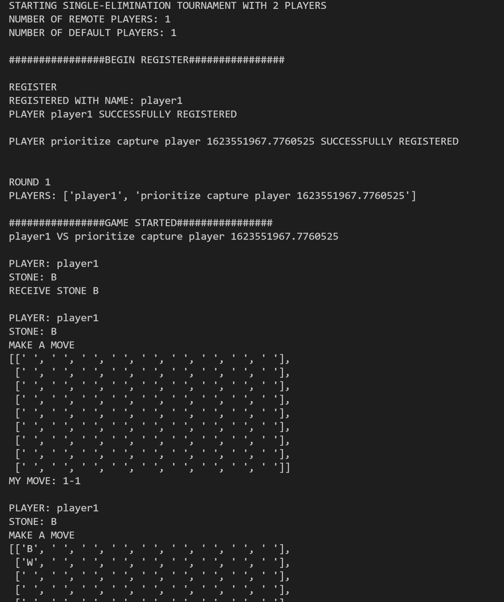
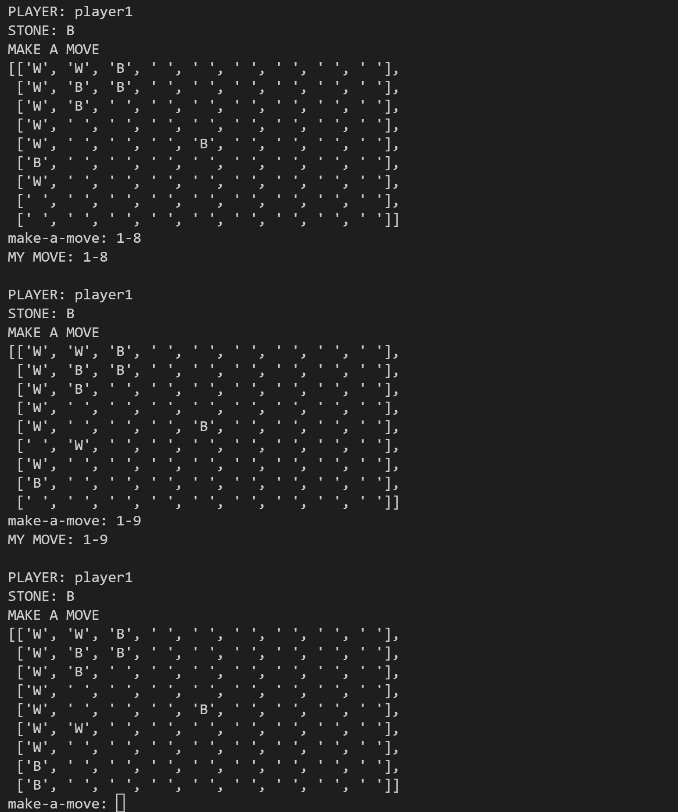

# Go Game

Multiclient-server implementation of the game of [Go](https://en.wikipedia.org/wiki/Go_(game)) written in Python3.
The server mediates a tournament (either round-robin or single-elimination style) between an arbitrary number of
players. If the number of human players does not match a bracket size, the server will create computer players to fill
out the bracket.
Communication between clients and the server is done with a custom protocol on top of sockets.

Sample console printouts:

**Server console printout**


**Client console printout**



Next steps:
- The currently available computer players are not very competitive, and make moves using simple hueristics.
I hope to add smarter hueristics and a deep-learning based player.
- Currently, all IO is in the console, but it can be extended to display in a GUI
without changing the protocol.
- A JS client implementation using WebSockets, so the game can be played in the browser.

## How to run

Required: install python3 and pip3 (the Python3 version of the pip package manager).

### Installing dependencies
`pip3 install -r requirements.txt`

### Starting the game server
```
usage: python3 administrator.py --cup num_players
       python3 administrator.py --league num_players
```
The `--cup` flag tells the server to start a single-elimination tournament with `num_players` players.
The `--league` flag tells the server to start a round-robin tournament with `num_players` players.

Example:
`python3 administrator.py --cup 2`

### Starting a client
```
usage: python3 client_driver.py
```

### Playing (as a human)
When the server has started, it will wait for `num_players` clients to connect.
The server then registers each player by asking for a player name to use.

In a game, the referee follows a simple pattern:
Black receives stones -> White receives stones -> 
Black move -> White move -> Black move -> ... -> Illegal move or Win condition -> Game over

To input a move in the console, a human player should input the Japanese Go notation coordinates of the point where a stone should be placed. Japanese Go notation looks like `<column>-<row>`, where
the rows and columns of the board are 1-indexed (rather than 0-indexed). For example, `3-2` means
placing a stone on the 3rd column, 2nd row of the board. A player can also pass by giving the command `pass`.


### Configuring the clients and server
Clients and server read the follow params from `go.config`:
- `IP`: IP address for the server to listen at (or the client to connect to).
- `port`: Port number for the server to listen at (or the client to connect to).
- `default-player`: Path to a file that implements the Player interface. This will be used as the computer player if the server has to pad a tournament bracket with additional players.


### Explanation of the protocol
**TODO**